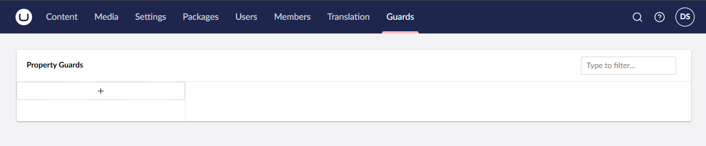
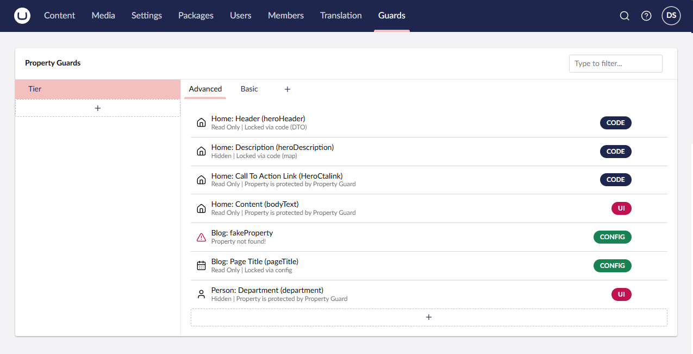
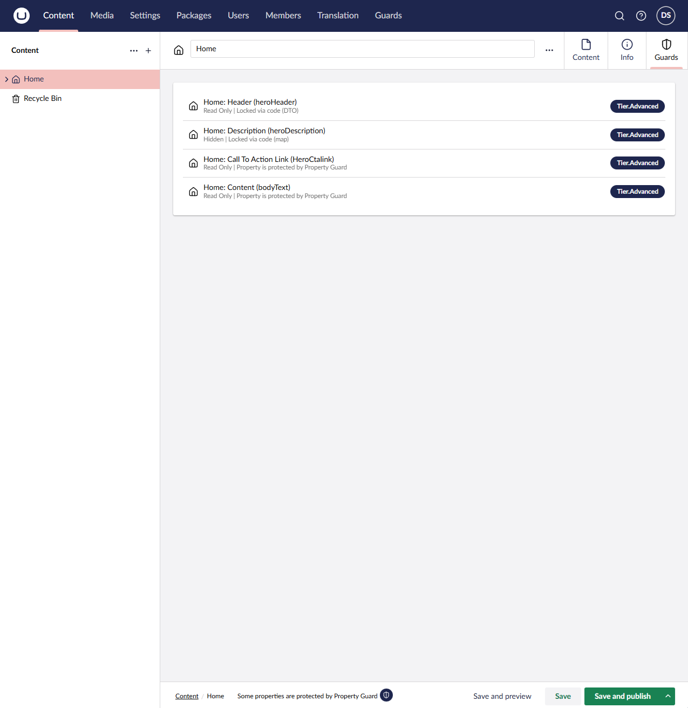
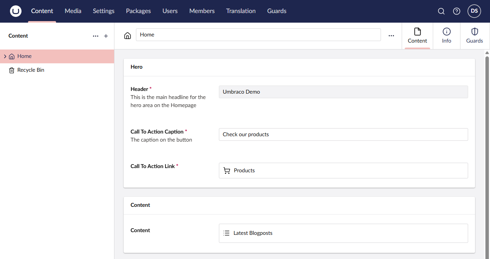
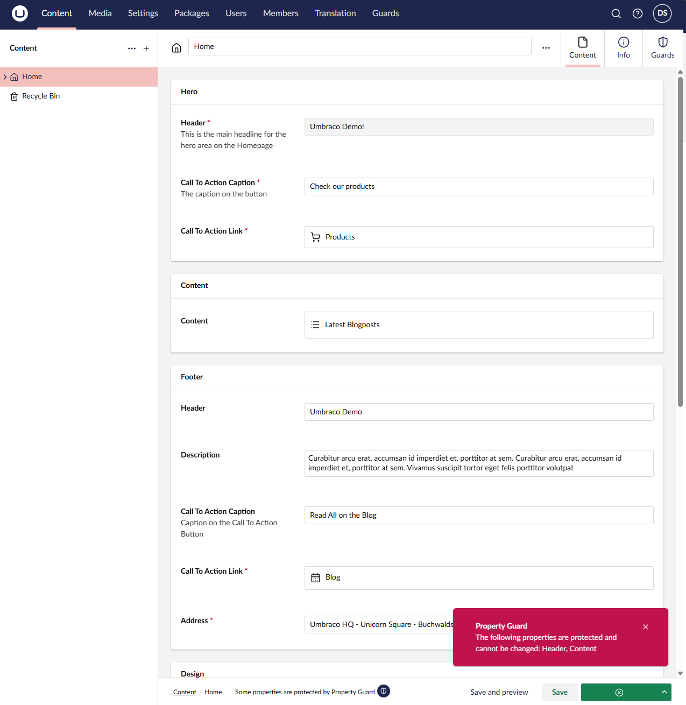
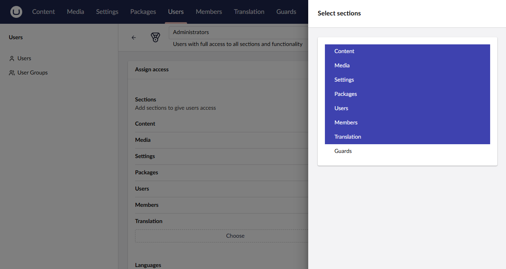

# Umbraco Community PropertyGuard

[](https://www.nuget.org/packages/Umbraco.Community.PropertyGuard)
[](LICENSE)

**PropertyGuard** is an Umbraco community package that protects content properties from being edited. Guards can be defined in code, configuration, or via the backoffice **Guards** section — no custom code required for the most common cases.

---

## Requirements

- Umbraco 17+
- .NET 10+

---

## Installation

```bash
dotnet add package Umbraco.Community.PropertyGuard
```

Register in `Program.cs`:

```csharp
builder.CreateUmbracoBuilder()
    .AddBackOffice()
    .AddWebsite()
    .AddPropertyGuard() // <-- add this
    .Build();
```

That's it. See [Section access](#section-access) to grant user groups access to the Guards section.

---

## Usage

There are three ways to define guards. They can be mixed freely.

### 1. UI (quickest way to get started — no config required)

Open the **Guards** section in the backoffice:

1. Click **+ Add feature** in the sidebar and name your feature (e.g. `Pricing`) — a **General** group is created automatically
2. Select a group to add guards under — click **+** in the tab bar to add more groups (e.g. `Advanced`)
3. Click **+ Add property guard** and pick a document type and property
4. Click **Apply**

Guards added via the UI are session-only — they live in memory and are cleared on app restart. Use the **Copy Config** button to copy the JSON and paste it into `appsettings.json` for permanent storage.





---

### Content editor

When a document type has guards, each content node of that type gains a **Guards** content app tab listing all active guards and their feature keys.



Guarded properties are rendered read-only (or hidden) in the **Content** tab. A notice in the footer indicates that some properties are protected.



If an editor attempts to save a change to a guarded property, the save is blocked and an error notification appears.



---

### 2. Code

Implement `IPropertyGuardDefinition` and register it:

```csharp
public class MyGuards : IPropertyGuardDefinition
{
    public void DefineMaps(IPropertyGuardRegistry registry)
    {
        // Single guard — full control over all fields
        registry.RegisterGuard(new PropertyGuardDto
        {
            DocumentTypeAlias = "homePage",
            PropertyAlias = "heroHeader",
            FeatureKey = "Pricing.Advanced",
        });

        // Multiple guards on the same document type
        IPropertyGuardMap map = new PropertyGuardMap()
            .Add("heroSubtitle", featureKey: "Pricing.Advanced")
            .Add("price", featureKey: "Pricing.Basic", mode: PropertyGuardMode.Hidden);

        registry.RegisterGuard("homePage", map);

        // Fluent — concise for adding one or two properties
        registry.CreateGuard("productPage")
            .RegisterProperty("sku", featureKey: "Pricing.Basic");
    }
}
```

If you use **Umbraco Models Builder**, PropertyGuard compares both document type aliases and property aliases case-insensitively, so `nameof()` works for both — `nameof(HomePage)` matches `"homePage"` and `nameof(HomePage.HeroHeader)` matches `"heroHeader"`:

```csharp
// ModelTypeAlias is a generated const — exact alias, no case handling needed
registry.RegisterGuard(new PropertyGuardDto
{
    DocumentTypeAlias = HomePage.ModelTypeAlias,
    PropertyAlias = nameof(HomePage.HeroHeader),
    FeatureKey = "Pricing.Advanced",
});

// nameof() also works — PropertyGuard compares both aliases case-insensitively
registry.CreateGuard(nameof(HomePage))
    .RegisterProperty(nameof(HomePage.HeroHeader), featureKey: "Pricing.Advanced");
```

Register via `Program.cs` alongside `AddPropertyGuard()`:

```csharp
.AddPropertyGuard()
.AddPropertyGuard<MyGuards>()
```

Or via a composer — useful when you want to keep registration out of `Program.cs`:

```csharp
public class MyComposer : IComposer
{
    public void Compose(IUmbracoBuilder builder)
    {
        // Single
        builder.AddPropertyGuard<MyGuards>();

        // Multiple — fluent chain
        builder
            .AddPropertyGuard<MyGuards>()
            .AddPropertyGuard<AnotherGuards>();

        // Multiple — collection builder
        builder.WithCollectionBuilder<PropertyGuardDefinitionCollectionBuilder>()
            .Add<MyGuards>()
            .Add<AnotherGuards>();
    }
}
```

---

### 3. Configuration (`appsettings.json`)

```json
{
  "PropertyGuard": {
    "Definitions": [
      {
        "DocumentTypeAlias": "homePage",
        "PropertyAlias": "heroHeader",
        "FeatureKey": "Pricing.Advanced"
      },
      {
        "DocumentTypeAlias": "productPage",
        "PropertyAlias": "price",
        "FeatureKey": "Pricing.Basic",
        "Mode": "Hidden"
      }
    ]
  }
}
```

---

## Guard modes

| Mode | Behaviour |
|---|---|
| `ReadOnly` (default) | Property is visible but cannot be edited |
| `Hidden` | Property is hidden from the editor entirely |

---

## Feature keys

`FeatureKey` always follows `"Feature.Group"` dot notation — the dot is required. The part before the dot is the feature name; the part after is the group within that feature.

Examples: `"Pricing.General"`, `"Pricing.Advanced"`, `"SensitiveData.General"`.

Guards without an explicit feature key are placed under `"PropertyGuards.General"`.

The backoffice Guards section uses feature keys to render a two-level sidebar + tabs layout.

---

## Section access

No user group has access to the Guards section by default. Grant access to any group via:

1. Go to **Users → User Groups** in the backoffice
2. Open the group you want to grant access to
3. Add **Guards** to the allowed sections
4. Save



---

## License

MIT — [Daniel Smallbone](https://github.com/dannysmallbone)
